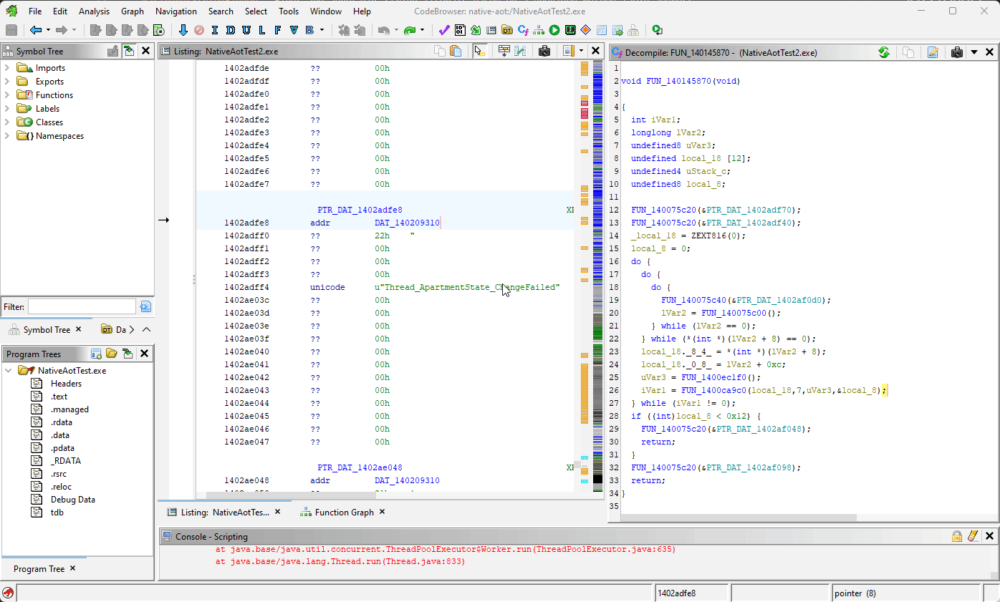
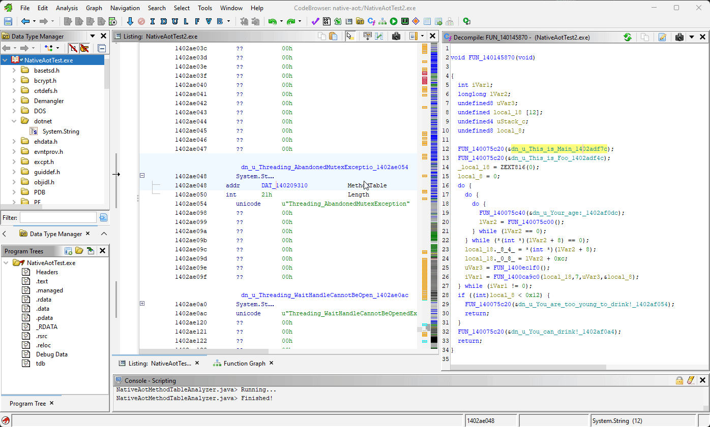

# Ghidra + NativeAOT

NativeAOT-compiled programs are binaries that have the .NET runtime as well as all the .NET metadata statically linked into a single binary that can run natively on the target host.
Because of the sheer amount of code and data, it can be difficult to analyze them sometimes.
This is why, since the release of NativeAOT, malware developers have taken an interest in using this technique not just for portability but also as a means of obfuscation.

This repo contains a collection of Ghidra scripts that may help in analyzing these types of files with Ghidra.

## How to Use

Add the `src` folder of this repo to the Ghidra scripts folders.
The scripts should then appear in the Script Manager under the `NativeAOT` category.

## Disclaimer 

The scripts have been tested with Ghidra 10.4 and only on Windows x64 PEs and Linux x64 ELFs.

## Contents

### NativeAotStringFinder

Finds and annotates string literals based on a provided Method Table address representing `System.String`.

### NativeAotMethodTableAnalyzer

Recursively (but non-exhaustively) discovers and parses Method Tables (essentially .NET's version of types/vtables) based on an initial Method Table address.

## License

MIT