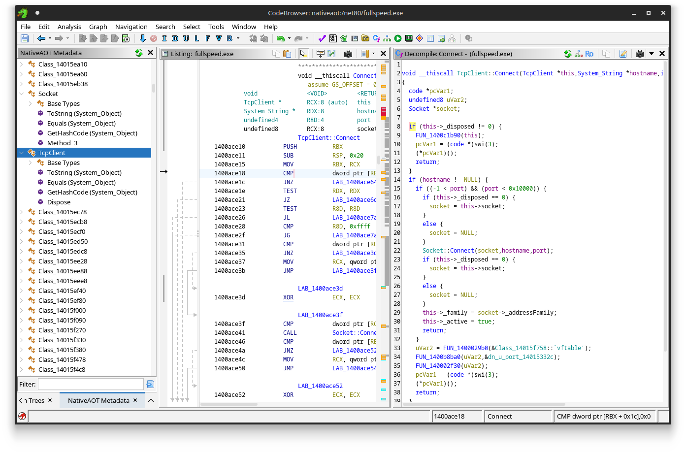
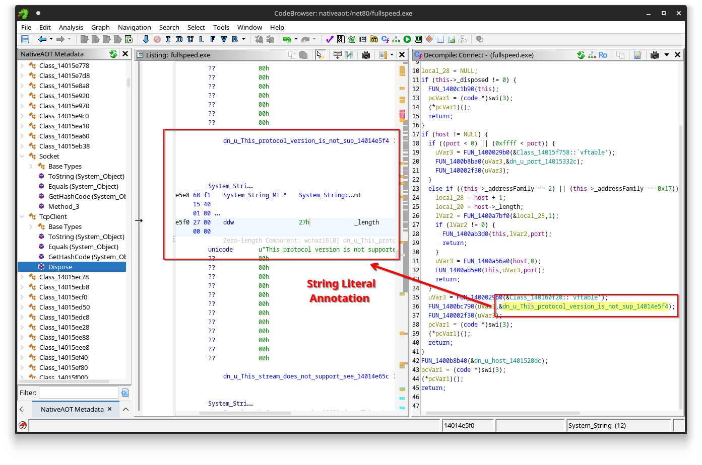
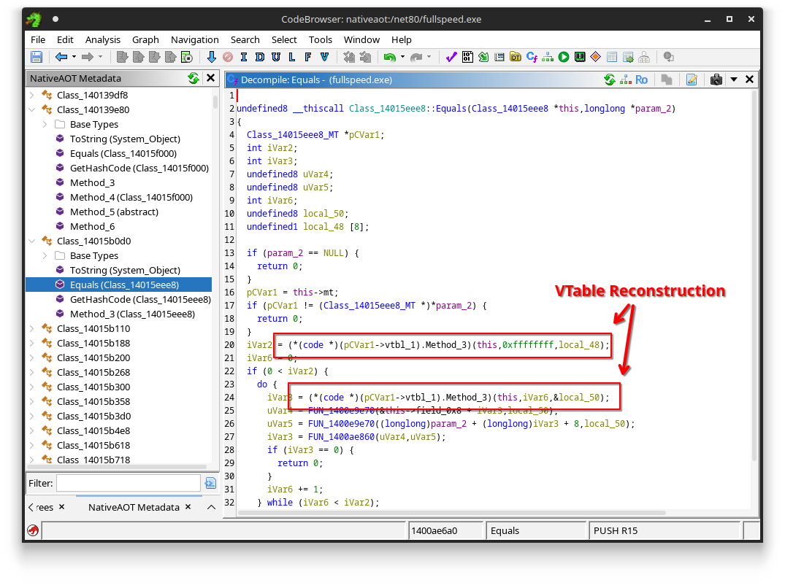
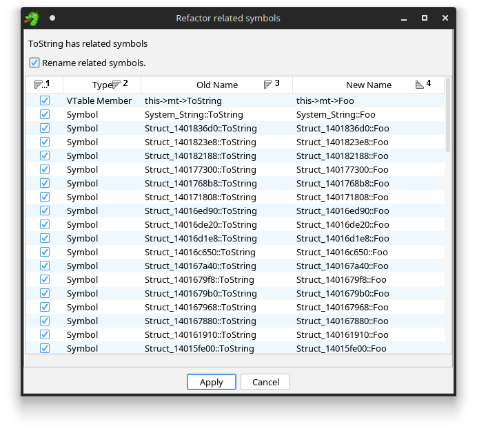
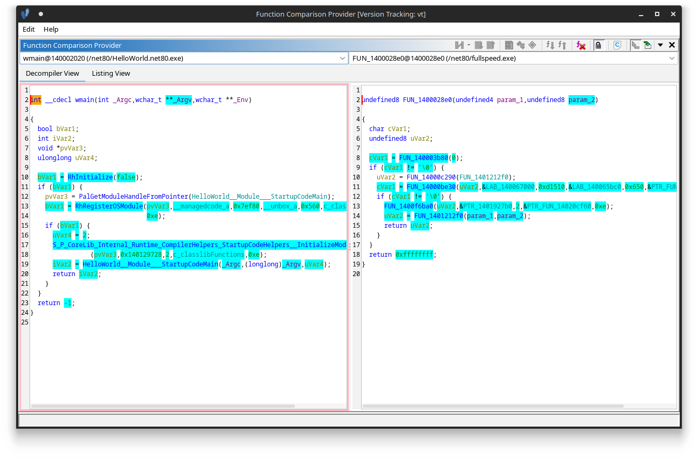
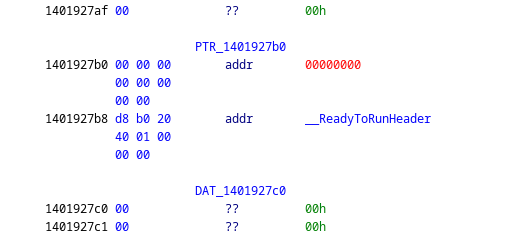
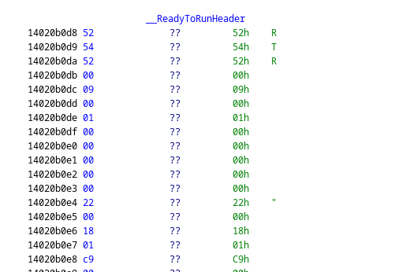

# Ghidra + .NET Native AOT

This is a Ghidra analyzer and UI plugin that helps in reverse engineering binaries compiled using .NET Native AOT technology introduced in .NET 8.0 and above, for which the symbols are not available and thus no FunctionID (FID) databases can be made easily.

See also the accompanied [blog post](https://blog.washi.dev/posts/recovering-nativeaot-metadata/) explaining how it works.

<div style="text-align:center">
    
</div>


## Features

- [x] Full Type Hierarchy (Method Table) Reconstruction
- [x] Frozen Object Annotation (e.g. Strings)
- [x] Interactive Metadata Browser
- [x] Refactoring Engine


## Screenshots

Automatic Frozen object (e.g., string literal) annotations.


Automatic VTable redirection detection.


Refactor virtual methods and related symbols.



## Building

Run `gradle` in the root directory:

```sh
$ gradle
```

This will produce a plugin ZIP in the `dist/` folder.

Running the above command assumes Ghidra to be installed under `/opt/ghidra`.
If you have Ghidra installed somewhere else on your machine, you may need to specify the Ghidra installation directory for it to find the appropriate dependencies:

```sh
$ gradle -PGHIDRA_INSTALL_DIR=/path/to/ghidra
```

## Installing

Install the plugin using `File > Install Extensions` menu in the main project window.


## Quick Starters Guide

Steps:

- Make sure you have the plugin installed (see [Building](#building) and [Installing](#installing)).
- Make sure that you have the ReadyToRun directory annotated in your binary with the `__ReadyToRunHeader` label.
- Run the Native AOT Analyzer (Either as a One-Shot Analysis or part of Auto-Analysis).
- Open the Native AOT Metadata Browser from the Windows Menu.


### How to Find the ReadyToRun Directory?

The ReadyToRun data directory is the root of all .NET Native AOT metadata.
Currently, the plugin does not support automatically locating this, however, the directory is referenced in a call to `S_P_CoreLib_Internal_Runtime_CompilerHelpers_StartupCodeHelpers__InitializeModules` in `wmain`.

You can find this call by e.g., compiling a simple Hello World application using Native AOT with symbols, and using Ghidra's Version Tracking Tool to compare functions.

Left: Hello World app, Right: Unknown Native AOT Binary ([Challenge fullspeed.exe of Flare-On 11](https://washi1337.github.io/ctf-writeups/writeups/flare-on/2024/7/)):



The second argument (`PTR_1401927b0` in the screenshot) of the `InitializeModules` call is an array of pointers:



You can recognize the pointer is referencing the ReadyToRun directory when it points to data starting with `RTR\0`:



Once you have this data with the label  `__ReadyToRunHeader`, you can use the analyzer.


## Development

Any editor supporting Gradle should work, including IntelliJ and Visual Studio Code.

For Visual Studio Code, some additional settings in the `.vscode` directory are put, pointing to the dependencies of the Ghidra dependencies. Adjust accordingly if you have Ghidra installed in another location.

For quickly reinstalling the plugin as well as starting ghidra, use a command like the following (change file paths accordingly):

```sh
$ gradle && unzip -o dist/ghidra_11.3.1_PUBLIC_XXXXXXXX_ghidra-nativeaot.zip -d ~/.config/ghidra/ghidra_11.3.1_PUBLIC/Extensions/ && ghidra
```

## License

MIT


## Acknowledgements

Browser icons from https://intellij-icons.jetbrains.design/ (Apache 2 Licensed)
